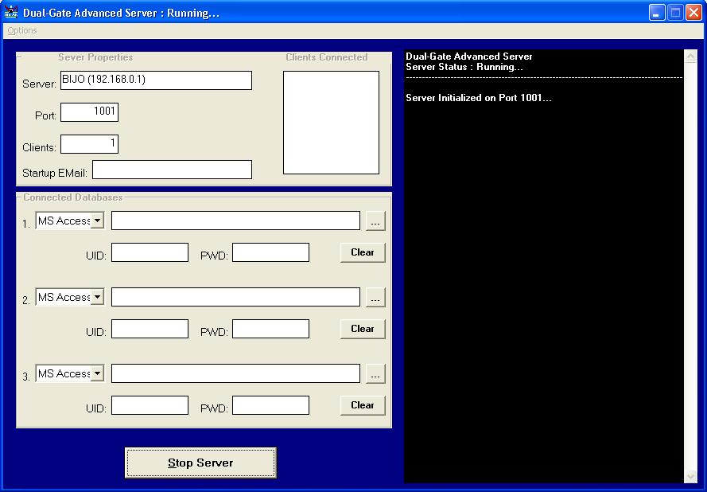



## A true client \- server application

### Description

I was sick of people telling that VB cannot be used for a true client server application that too on the internet, Check this Server Client, this is a must see for advanced programmers.

The client connects to the server and databases even if on the net for both MS SQL &amp; MS Access Databases.

Can fetch more than 100,000 records and can upload/download files.

The server can also send startup mails to configured e-mails id; useful if the server is a dial up machine....

A must see by any ways...Dont forget to vote for me.... I need your comments &amp; suggestions too!!!

So hows it doing ?????

Guys....I need your vote / comments to review the performance of the software...if you have any queries pls feel free to email me at : bijo_mathew@hotmail.com
 
### More Info
 

             |
---                |---
**Submitted On**   |2006-02-04 01:10:02
**By**             |[Bijo Mathew](https://github.com/Planet-Source-Code/PSCIndex/blob/master/ByAuthor/bijo-mathew.md)
**Level**          |Advanced
**User Rating**    |4.5 (36 globes from 8 users)
**Compatibility**  |VB 4\.0 \(32\-bit\), VB 5\.0, VB 6\.0, VBA MS Access
**Category**       |[Complete Applications](https://github.com/Planet-Source-Code/PSCIndex/blob/master/ByCategory/complete-applications__1-27.md)
**World**          |[Visual Basic](https://github.com/Planet-Source-Code/PSCIndex/blob/master/ByWorld/visual-basic.md)
**Archive File**   |[A\_true\_cli1964471122006\.zip](https://github.com/Planet-Source-Code/bijo-mathew-a-true-client-server-application__1-64013/archive/master.zip)

